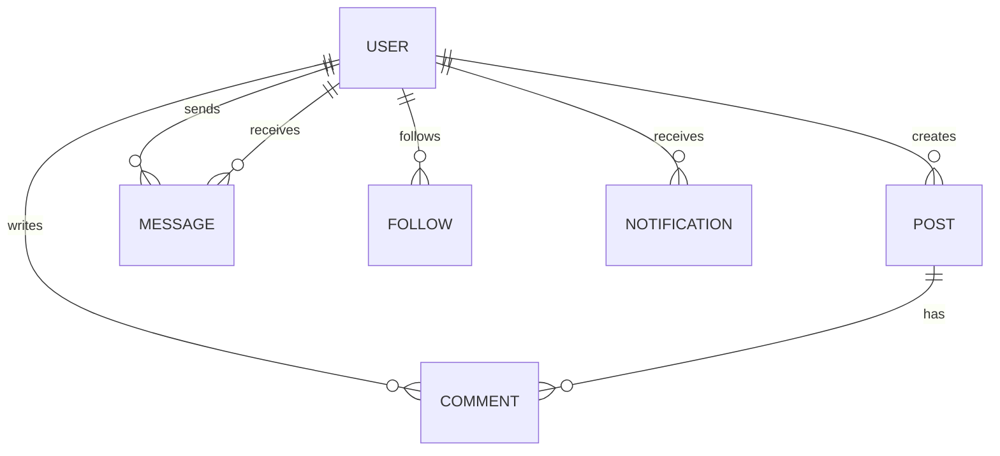

# MOA Market SDD

## 執行摘要

MOA Market 是一個以韓團 TXT 周邊交換為核心的社群平台原型。介面方向參考 Instagram / Facebook 的動態牆，聚焦 CD、照片小卡、小物等收藏交換，不包含任何金流或付款流程。

## MVP 範圍

- 會員帳號密碼登入與註冊示範
- 交換貼文 Feed：照片、文字、分類、狀態、標籤
- 貼文互動：按讚、留言、私訊入口
- 搜尋與分類篩選：全部、CD、照片小卡、小物
- 私訊頁：近即時聊天體驗原型
- 個人頁：會員資訊與自己的貼文
- 管理後台示範：審核統計與貼文通過操作
- Mobile-first 響應式設計與底部導航

## 技術選型

- Frontend: Next.js App Router + React + TypeScript
- Styling: Tailwind CSS v4 + 自訂韓式清爽色票
- Icons: lucide-react
- Data: Supabase Postgres；未設定環境變數時使用 localStorage demo fallback
- Auth: Supabase Auth；未設定環境變數時使用 demo 帳密
- Image Storage: Cloudinary unsigned upload preset；未設定環境變數時使用瀏覽器 data URL 暫存
- Deployment: GitHub + Vercel

## 後續正式化建議

- Auth: Firebase Auth 或自建 JWT + bcrypt
- Database: PostgreSQL / Neon / Supabase，或 Firebase Firestore
- Storage: Cloudinary / Firebase Storage / Vercel Blob
- Realtime: Firestore realtime、Pusher、或 WebSocket
- Moderation: 管理員權限、檢舉流程、關鍵字與圖片審核

## 核心資料模型

## 部署流程

1. 初始化 Git repository。
2. 推送至 GitHub。
3. 建立 Supabase project，執行 `supabase/schema.sql`。
4. 建立 Cloudinary unsigned upload preset。
5. 在 Vercel 設定 `NEXT_PUBLIC_SUPABASE_URL`、`NEXT_PUBLIC_SUPABASE_ANON_KEY`、`NEXT_PUBLIC_CLOUDINARY_CLOUD_NAME`、`NEXT_PUBLIC_CLOUDINARY_UPLOAD_PRESET`。
6. 使用 Vercel CLI 或 Git integration 部署 production。
